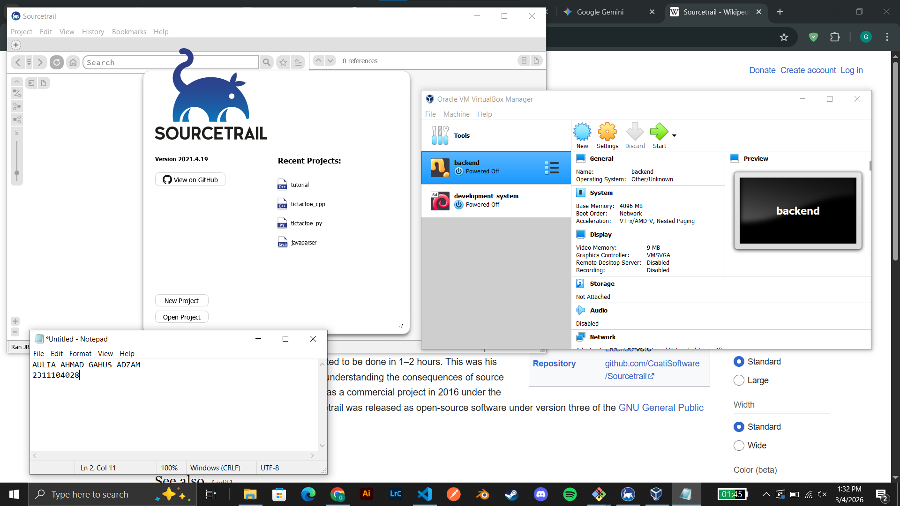

# <h1 align="center">Laporan Praktikum Modul 1   01 Running Module</h1>

Aulia Ahmad Ghaus Adzam - 2311104028

## Dasar Teori

VirtualBox VirtualBox adalah perangkat lunak virtualisasi (hypervisor) gratis dari Oracle yang memungkinkan Kita menjalankan beberapa sistem operasi (seperti Linux, Windows, atau macOS) secara bersamaan di dalam satu komputer fisik. Aplikasi ini bekerja dengan cara mengalokasikan sumber daya komputer Kita untuk membuat "mesin virtual" yang terisolasi, sehingga sangat aman dan praktis digunakan untuk bereksperimen, menguji perangkat lunak, atau menjalankan server tanpa risiko merusak sistem utama di komputer kita.

Xinu Xinu (singkatan dari Xinu Is Not Unix) adalah sistem operasi berukuran sangat kecil dan ringan yang diciptakan oleh Douglas Comer secara khusus untuk tujuan pendidikan dan pembelajaran ilmu komputer. Berbeda dengan sistem operasi modern yang sangat kompleks, Xinu sengaja dirancang dengan basis kode yang elegan, ringkas, dan mudah dibaca, sehingga sangat ideal digunakan oleh mahasiswa untuk membedah dan memahami konsep-konsep fundamental tentang bagaimana sebuah sistem operasi bekerja di tingkat paling dasar.

Sourcetrail Sourcetrail adalah aplikasi penjelajah kode sumber visual (visual source explorer) yang berfungsi untuk membantu developer memahami struktur basis kode (codebase) yang besar dan rumit dengan jauh lebih cepat. Alat ini bekerja dengan cara memindai kode (seperti C/C++, Java, atau Python) lalu mengubahnya menjadi grafik interaktif yang memetakan hubungan antar kelas, fungsi, dan variabel, sehingga Kita bisa melihat gambaran besar arsitektur sebuah program tanpa harus tersesat membaca ribuan baris teks secara manual.

## Guided

Instalasi VirtualBox Dan Sourcetrail

## Referensi

1. https://en.wikipedia.org/wiki/VirtualBox
2. https://en.wikipedia.org/wiki/Sourcetrail