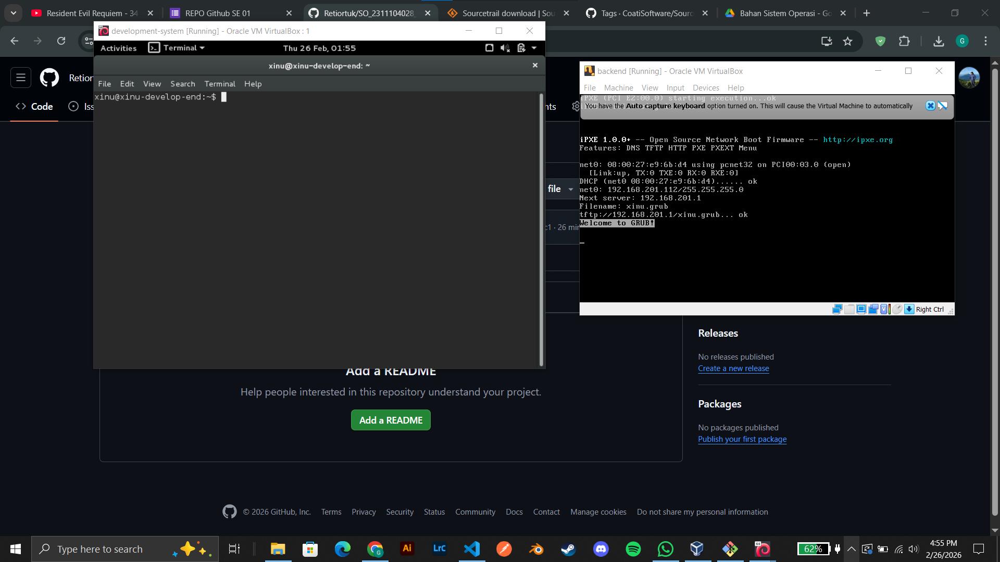

# <h1 align="center">Laporan Praktikum Modul 2   02 Instalasi Xinu</h1>

Aulia Ahmad Ghaus Adzam - 2311104028

## Dasar Teori

Xinu (Xinu Is Not Unix) adalah sistem operasi berukuran sangat kecil dan berarsitektur elegan yang dirancang secara khusus oleh Douglas Comer untuk tujuan pendidikan. Berbeda dengan sistem operasi modern yang sangat kompleks, basis kode Xinu sengaja dibuat ringkas, transparan, dan mudah dibaca agar para pelajar bisa langsung membedah, memahami, dan memodifikasi komponen inti dari sebuah sistem operasi—seperti manajemen memori dan penjadwalan proses. Karena tujuannya murni untuk eksperimen akademik, Xinu sangat ideal dijalankan di dalam lingkungan yang aman seperti VirtualBox, sementara struktur kodenya dapat divisualisasikan dengan mudah menggunakan aplikasi penjelajah kode seperti Sourcetrail.

## Guided

Instalasi Xinu

## Referensi

1. https://en.wikipedia.org/wiki/Xinu
