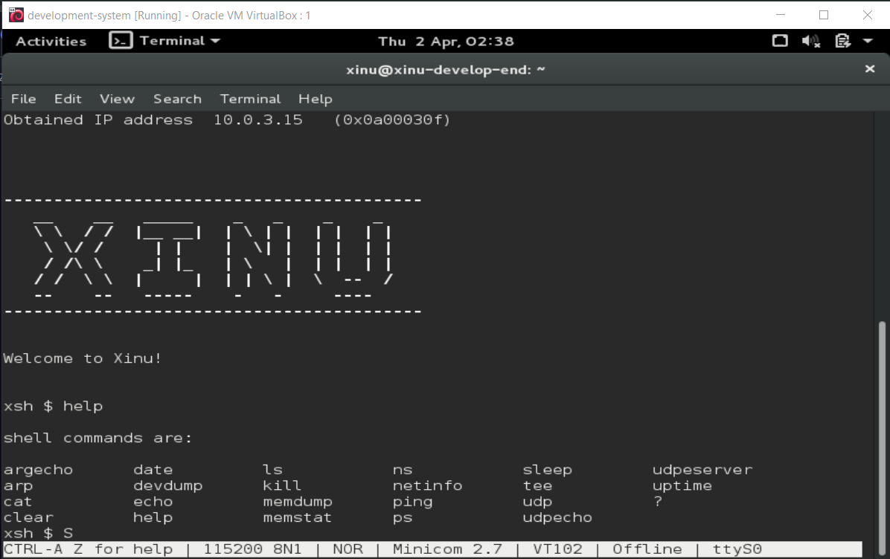

# <h1 align="center">Laporan Praktikum Modul 3   03 Eksplorasi Xinu</h1>

Aulia Ahmad Ghaus Adzam - 2311104028

## Dasar Teori

Xinu (Xinu Is Not Unix) adalah sistem operasi berukuran sangat kecil dan berarsitektur elegan yang dirancang secara khusus oleh Douglas Comer untuk tujuan pendidikan. Berbeda dengan sistem operasi modern yang sangat kompleks, basis kode Xinu sengaja dibuat ringkas, transparan, dan mudah dibaca agar para pelajar bisa langsung membedah, memahami, dan memodifikasi komponen inti dari sebuah sistem operasi—seperti manajemen memori dan penjadwalan proses. Karena tujuannya murni untuk eksperimen akademik, Xinu sangat ideal dijalankan di dalam lingkungan yang aman seperti VirtualBox.

## Guided

Pada kali ini kita atau saya sudah mempelajari bagaimana caranya menampilkan perintah command "help" pada Xinu yang mana berfungsi untuk Menampilkan daftar semua perintah (command) yang tersedia pada shell Xinu beserta deskripsi singkatnya

## Pertanyaan

**1. Berapa jumlah perintah pada Xinu?**
**Jawab:** Ada 24 Perintah Dasar

**2. Sebutkan 2 perintah yang mempunyai fungsi yang sama!**
**Jawab:** Perintah "help" dan "?" memiliki perintah yang sama yaitu untuk menampilkan menu bantuan

**3. Berapa IP Adress Xinu?**
**Jawab:** Untuk Saya IP Adress Xinu di Sistem Saya Adalah "10.0.3.15" Namun Biasanya Dapat Berupa "192.168.1.1"
    
**4. Perintah apa yang digunakan untuk mengetahui IP address?**
**Jawab:** perintah "netinfo"

**5. Berapa IP DNS server yang digunakan oleh Xinu?**
**Jawab:** saya "192.168.1.1."

**6. Terdapat berapa proses yang sedang berjalan pada Xinu?**
**Jawab:** biasanya sekitar 3-6 proses default seperti prnull, main, shell, netin, netout.

**7. Proses apa yang mempunyai prioritas paling rendah?**
**Jawab:** yang paling rendah hampir selalu bernama prnull (Null process)

**8. Proses apa yang mempunyai prioritas paling besar?**
**Jawab:** yang paling besar itu Main Process.

**9. Proses apa yang berada dalam state current?**
**Jawab:** Biasanya ini adalah proses shell yang lagi kita jalanin alias Main Process.

**10. Proses apa yang berada dalam state suspend?**
**Jawab:** shell yang sedang berjalan namun lagi menunggu perintah dari kita

**11. Berapa PID (Process ID) dari Main process?**
**Jawab:** 1 PID

## Referensi

1. https://en.wikipedia.org/wiki/Xinu
