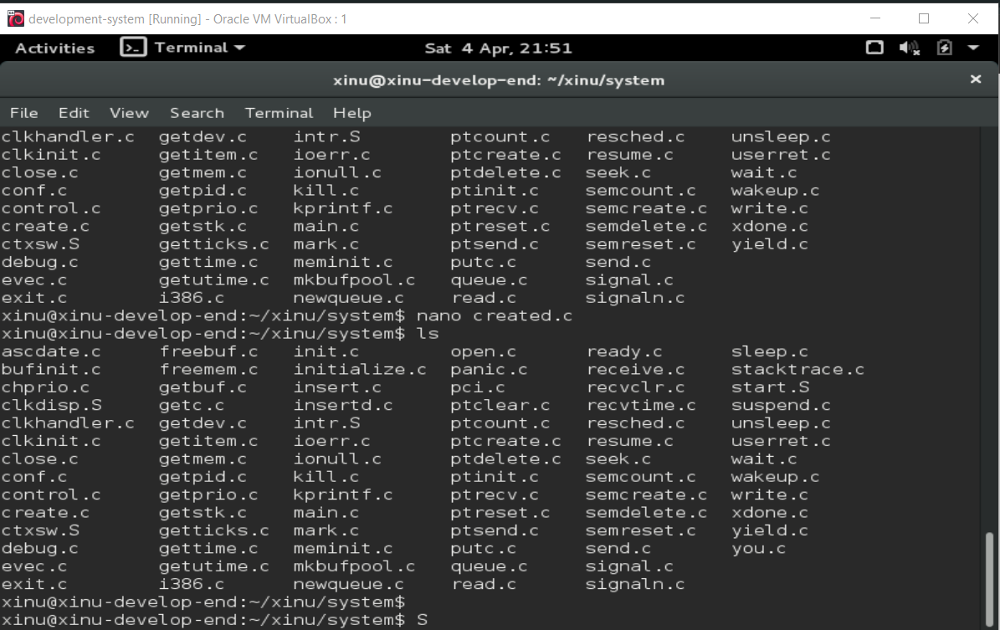
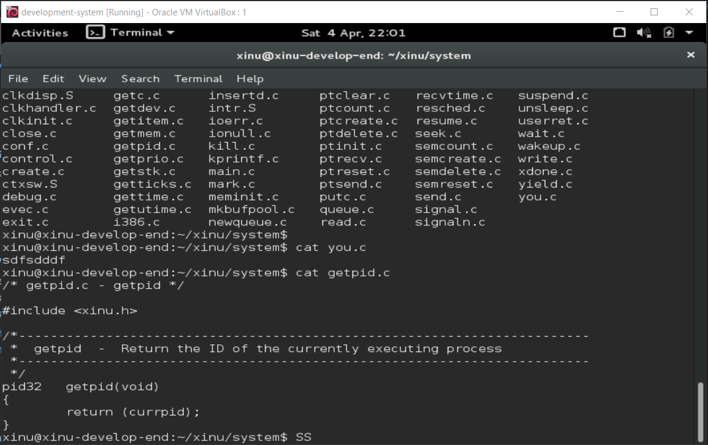
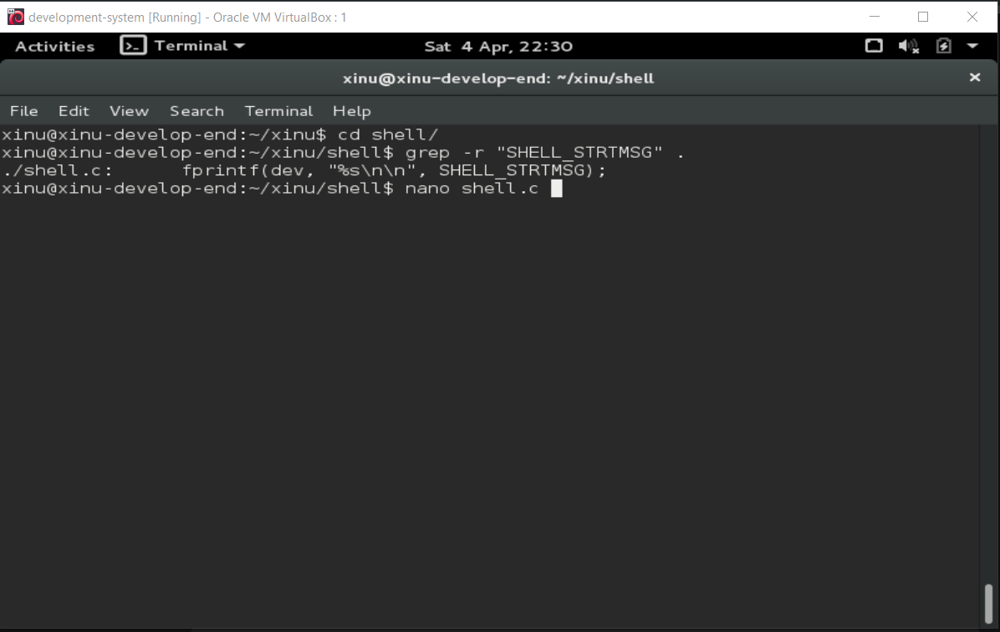
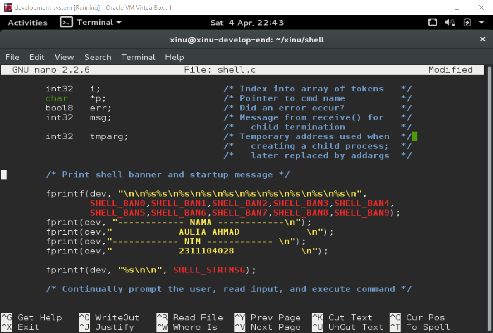

# <h1 align="center">Laporan Praktikum Modul 4   04 Membaca Source Code Xinu</h1>

Aulia Ahmad Ghaus Adzam - 2311104028

## Dasar Teori

Xinu (Xinu Is Not Unix) adalah sistem operasi yang dirancang secara khusus oleh Douglas Comer dengan arsitektur yang berfokus pada kejelasan dan kesederhanaan, menjadikannya subjek yang sangat ideal untuk studi literatur kode. Berbeda dengan sistem operasi modern yang memiliki jutaan baris kode kompleks, source code Xinu sengaja ditulis secara ringkas, terstruktur rapi, dan sangat transparan. Pendekatan ini memungkinkan pelajar untuk secara langsung membaca, menelusuri, dan membedah logika pemrograman dari komponen-komponen inti sistem operasi seperti manajemen memori, penjadwalan proses, dan manajemen device. Dengan membaca source code Xinu, pemahaman teoretis mengenai sistem operasi dapat diubah menjadi wawasan praktis, di mana mekanisme tingkat rendah (low-level) dapat dianalisis dan dipahami instruksi demi instruksinya.

## Guided

Pada kali ini saya mengerjakan jurnal, memahami struktur source code Xinu dan  mampu melakukan modifikasi sederhana pada Xinu.

## Jurnal

**1. Apa nama image yang dihasilkan setelah melakukan kompilasi pada Xinu? Berapa ukuran file tersebut? Ada pada folder apa file image tersebut?**
**Jawab:** Setelah melakukan kompilasi pada sistem operasi Xinu, file image yang dihasilkan secara default bernama xinu (tanpa ekstensi, atau terkadang xinu.boot bergantung pada konfigurasi). Ukuran file tersebut sangat kecil dan bervariasi sesuai modifikasi yang dilakukan, tapi umumnya hanya berkisar antara 100 KB hingga 500 KB, yang ukuran pastinya bisa kamu cek langsung menggunakan perintah ls -lh xinu di terminal. Adapun file image hasil kompilasi tersebut disimpan di dalam folder compile/ pada direktori utama Xinu

**2. Membaca Source Code Xinu**
**Jawab:**
1. 

2. 

**3. Carilah struktur data dari proses pada Xinu OS. Struktur data proses ada pada file apa? Informasi apa saja yang disimpan dalam struktur data tersebut?**
**Jawab:** Struktur data yang merepresentasikan dan menyimpan state sebuah proses pada sistem operasi Xinu disebut dengan procent (process entry), yang mana kumpulannya dikelola dalam sebuah array global bernama proctab. Struktur data ini didefinisikan di dalam file header bernama proc.h (umumnya dapat kamu temukan di dalam folder include/). Di dalam struct procent tersebut, tersimpan berbagai informasi krusial layaknya sebuah Process Control Block (PCB) yang dibutuhkan Xinu untuk melakukan manajemen dan penjadwalan proses, meliputi: status proses saat ini (seperti free, ready, current, suspended, atau waiting) pada atribut prstate, prioritas pengeksekusian proses (prprio), manajemen memori stack seperti stack pointer, stack base, dan panjang stack (prstkptr, prstkbase, prstklen), identitas proses beserta ID parent-nya (prpid, prparent), nama proses untuk keperluan identifikasi (prname), hingga variabel untuk sistem komunikasi antar-proses (IPC) seperti buffer pesan masuk (prmsg) dan penanda ketersediaan pesan tersebut (prhasmsg).
    
**4. Perintah apa yang digunakan untuk mengetahui IP address?**
**Jawab:**

## Referensi

1. https://en.wikipedia.org/wiki/Xinu
